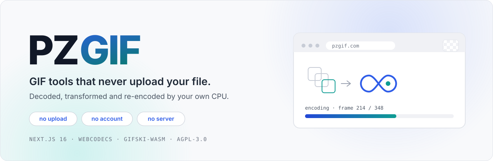
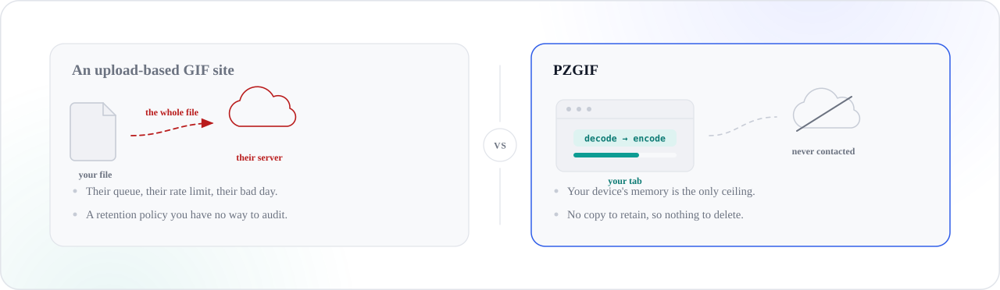
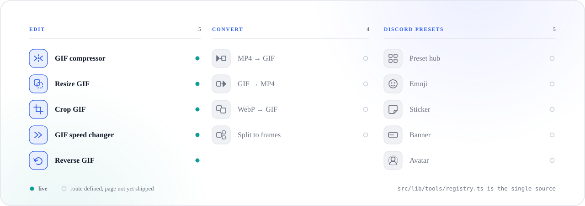
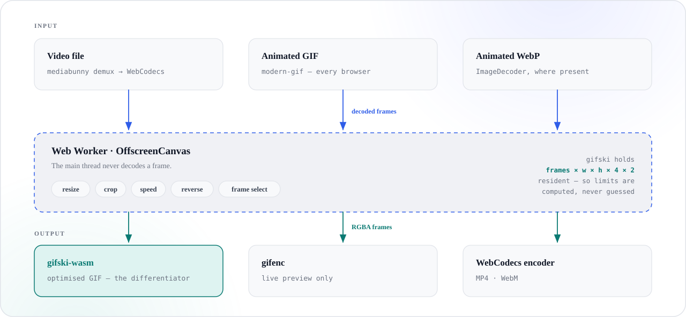

<div align="center">

<picture>
  <source media="(prefers-color-scheme: dark)" srcset=".github/assets/hero-dark.svg">
  
</picture>

<br><br>

[](https://pzgif.com)
[](https://github.com/jhin1m/pzgif/actions/workflows/ci.yml)
[](./LICENSE)

<sub><a href="#the-difference">The difference</a> &nbsp;·&nbsp; <a href="#the-tools">Tools</a> &nbsp;·&nbsp; <a href="#the-engine">Engine</a> &nbsp;·&nbsp; <a href="#run-it">Run it</a> &nbsp;·&nbsp; <a href="#why-the-source-is-public">Licence</a></sub>

</div>

<br>

Drop a GIF or a video in. It is decoded, transformed and re-encoded by your own
CPU, inside a Web Worker in the tab you already have open. There is nothing to
delete afterwards, because nothing was ever sent.

<br>

## The difference

<picture>
  <source media="(prefers-color-scheme: dark)" srcset=".github/assets/promise-dark.svg">
  
</picture>

<br>

<picture>
  <source media="(prefers-color-scheme: dark)" srcset=".github/assets/stats-dark.svg">
  
</picture>

<br>

## The tools

<picture>
  <source media="(prefers-color-scheme: dark)" srcset=".github/assets/tools-dark.svg">
  
</picture>

Scope is fixed at nine tools and a Discord preset cluster, and it is not going
to grow. `src/lib/tools/registry.ts` is the one typed source for routes, nav,
footer and sitemap — `status` there is authoritative, and the sitemap filters on
it so a crawl never lands on a 404.

<br>

## The engine

<picture>
  <source media="(prefers-color-scheme: dark)" srcset=".github/assets/engine-dark.svg">
  
</picture>

**gifski is the differentiator.** Most browser-side competitors ship `gif.js` or
`gifenc` and look visibly worse for it. The cost of choosing better output is the
licence at the bottom of this page.

**Limits are computed, not guessed.** gifski holds every frame resident and
cannot stream, so admission control refuses a job *before* decode and offers
concrete alternative settings — never an OOM halfway through. Input file size is
not the binding constraint, and is never advertised as one.

<br>

## Three rules that override everything

They are not style preferences. Each one has a script that enforces it.

> **One — no page is cross-origin isolated.**
> `COEP: require-corp` breaks ad serving and `credentialless` is unsupported in
> Safari. Multi-threaded WASM needs `SharedArrayBuffer`, which needs isolation,
> so it is out permanently. `pnpm check:forbidden` fails the build if anything
> reintroduces it.

> **Two — progress is never faked.**
> Every percentage comes off a real counter: a decoded-frame index or an encoder
> callback. When progress is genuinely unknown the UI shows an indeterminate
> track and the word *Preparing…*, not an invented ramp.

> **Three — prose is never templated.**
> Fourteen near-identical pages filled from one template is exactly what Google's
> scaled-content-abuse policy penalises, and the penalty is site-wide. The
> registry owns structure only. Every word of explainer copy is hand-written.

<br>

## Run it

Node ≥ 20.9 and pnpm.

```bash
pnpm install
pnpm dev
```

That is the whole setup — no services, no keys, no database. `pnpm preview`
builds and runs on workerd, which is the real deploy target; `pnpm start` runs
the Next server and is not.

<details>
<summary><b>Every other script</b></summary>

<br>

| Command | What it does |
|---|---|
| `pnpm build` | Copies `.wasm` out of `node_modules`, then builds |
| `pnpm typecheck` | `tsc --noEmit` |
| `pnpm lint` | ESLint — Next 16 removed `next lint` |
| `pnpm test` | Vitest |
| `pnpm test:e2e` | Playwright, against a production build |
| `pnpm bench` | Engine benchmarks |
| `pnpm deploy` | Verifies the source SHA, builds, ships to Cloudflare |

Each guard below exists because something broke once:

| Command | Fails when |
|---|---|
| `pnpm check:forbidden` | Anything reintroduces `COOP`/`COEP`/`SharedArrayBuffer` |
| `pnpm check:static` | A route stops being statically prerenderable |
| `pnpm check:landing` | The landing bundle grows past its budget |
| `pnpm check:heavy` | A heavy dependency reaches a client chunk |
| `pnpm check:source-sha` | The footer's source link stops matching the built commit |

</details>

<details>
<summary><b>Where things live</b></summary>

<br>

```
src/app/[locale]/          SSG shells — [locale]/layout.tsx IS the root layout
src/middleware.ts          next-intl rewrite — deprecated name on purpose
src/lib/media/             the engine — all of it inside a Web Worker
src/lib/tools/registry.ts  one typed source: routes, nav, footer, sitemap
src/content/               hand-written per-tool copy — data files, not .tsx
src/components/            shared components; ui/ holds shadcn primitives
messages/                  next-intl UI strings
public/wasm/<version>/     .wasm binaries, immutable-cached
.github/assets/            README artwork — regenerate with generate.py
```

</details>

<details>
<summary><b>Documents that outrank this one</b></summary>

<br>

| File | Governs |
|---|---|
| [`CLAUDE.md`](./CLAUDE.md) | **Read first.** The three rules plus the conventions easiest to get wrong |
| [`docs/tech-stack.md`](./docs/tech-stack.md) | Architecture, library choices, rejected alternatives |
| [`docs/design-guidelines.md`](./docs/design-guidelines.md) | Tokens, component states, ad-slot law, a11y |
| [`docs/infrastructure-runbook.md`](./docs/infrastructure-runbook.md) | Everything needing an account or a DNS record |

`docs/wireframe/*.html` is the visual source of truth and a voice reference — but
its *numbers* are unverified until the copy audit clears them. Do not reuse them.

</details>

<br>

## Why the source is public

`gifski` — the encoder that makes the output visibly better than the usual
`gif.js` and `gifenc` competitors — is AGPL-3.0. Delivering it to a browser is
*conveyance*, so this client is published under the AGPL too. The footer of every
page links to the exact commit that page was built from.

Site copy and brand assets are a separate work and are **not** AGPL; see
[`LICENSE-CONTENT`](./LICENSE-CONTENT) and [`NOTICE`](./NOTICE). Run and modify
this privately with the content in place. To publish, bring your own.

**Code** — [GNU AGPL-3.0-or-later](./LICENSE) &nbsp;·&nbsp; **Content and brand** — [all rights reserved](./LICENSE-CONTENT)

<br>

<div align="center"><sub>

Built for the tab, not the cloud.

</sub></div>
