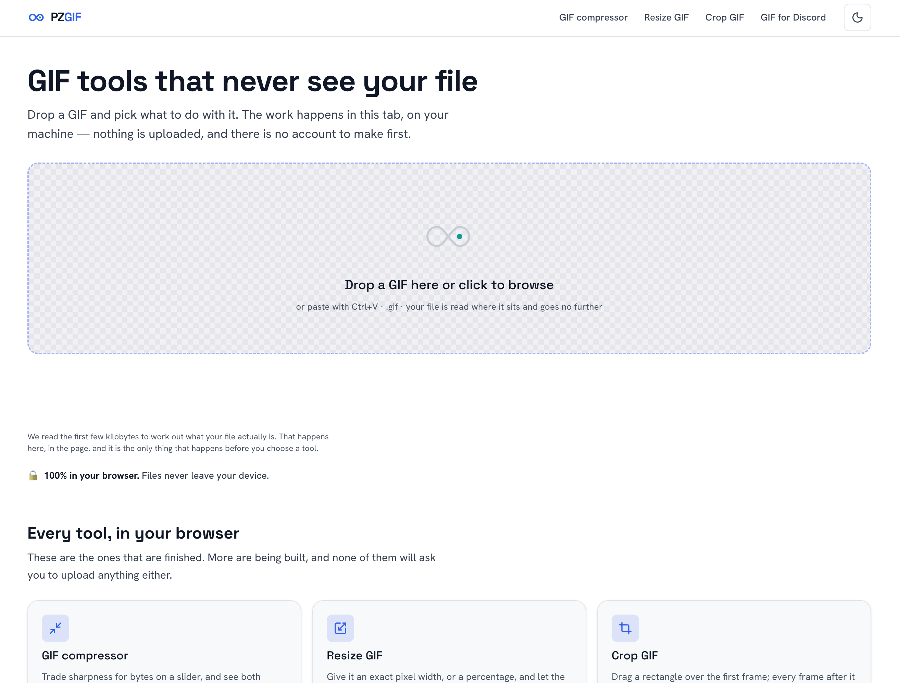

<div align="center">

# PZGIF

**GIF tools that never upload your file.**

Every operation runs inside your own tab — no upload, no account, no server in the loop.

[](https://pzgif.com)
[](https://github.com/jhin1m/pzgif/actions/workflows/ci.yml)
[](./LICENSE)

<sub>

Next.js 16 · React 19 · Tailwind v4 · WebCodecs · gifski-wasm · TypeScript

</sub>

</div>

---

---

## What it does

Drop a GIF or a video in. It is decoded, transformed and re-encoded by your own
CPU, inside a Web Worker. The bytes never leave the machine — there is nothing
to delete afterwards, because nothing was ever sent.

```
    your file ──▶ [ your browser tab ] ──▶ your file
                         ▲
                  no network hop here
```

## The three rules

Everything in this repo bends to these. They are not style preferences.

| | Rule | Why |
|:--:|---|---|
| **1** | **No page is cross-origin isolated.** | `COEP: require-corp` breaks ad serving and `credentialless` is unsupported in Safari. Multi-threaded WASM needs `SharedArrayBuffer`, which needs isolation — so it is out permanently. `pnpm check:forbidden` enforces this mechanically. |
| **2** | **Progress is never faked.** | Every percentage derives from a real counter — a decoded-frame index or an encoder callback. When progress is genuinely unknown, the UI shows an indeterminate track, not an invented ramp. |
| **3** | **Prose is never templated.** | Fourteen near-identical pages filled from one template is what Google's scaled-content-abuse policy penalises, site-wide. The registry owns structure only; every word of explainer copy is hand-written. |

## Tools

Scope is fixed at **9 tools + a Discord preset cluster**. `src/lib/tools/registry.ts`
is the single typed source for routes, nav, footer and sitemap.

<table>
<tr><th align="left">Edit</th><th align="left">Convert</th><th align="left">Discord presets</th></tr>
<tr valign="top"><td>

- ✅ GIF compressor
- ✅ Resize GIF
- ✅ Crop GIF
- ✅ GIF speed changer
- ✅ Reverse GIF

</td><td>

- ⬜ MP4 → GIF
- ⬜ GIF → MP4
- ⬜ WebP → GIF
- ⬜ Split GIF to frames

</td><td>

- ⬜ GIF for Discord *(hub)*
- ⬜ Emoji
- ⬜ Sticker
- ⬜ Banner
- ⬜ Avatar

</td></tr>
</table>

<sub>✅ shipped · ⬜ route defined, page not yet live. `status` in the registry is authoritative; the sitemap filters on it so a crawl never hits a 404.</sub>

## The engine

All of `src/lib/media/` runs inside a Web Worker. The main thread never decodes a frame.

```
File input
  ├─ video          → mediabunny (demux) → WebCodecs VideoDecoder
  ├─ animated GIF   → modern-gif          (every browser — Safari has no ImageDecoder)
  └─ animated WebP  → ImageDecoder        (where present)
                              │
                              ▼
              OffscreenCanvas in a Web Worker
        resize · crop · speed · reverse · frame select
                              │
                              ▼  RGBA frames
  ┌───────────────────────────┼───────────────────────────┐
  ▼                           ▼                           ▼
gifski-wasm                gifenc                  WebCodecs encoder
optimised GIF          live preview only            MP4 / WebM
```

**gifski is the differentiator.** Most browser-side competitors ship `gif.js` or
`gifenc` and look visibly worse. The cost of that choice is the licence below.

**Limits are computed, not guessed.** gifski holds `frames × w × h × 4 × 2` bytes
resident and cannot stream, so admission control refuses a job *before* decode
with concrete alternative settings — never an OOM mid-job. Input file size is
not the binding constraint and is never advertised as one.

## Getting started

Requires **Node ≥ 20.9** and **pnpm**.

```bash
pnpm install
pnpm dev          # Turbopack dev server on :3000
```

### Scripts

| Command | What it does |
|---|---|
| `pnpm build` | Copies `.wasm` out of `node_modules`, then builds |
| `pnpm typecheck` | `tsc --noEmit` |
| `pnpm lint` | ESLint — Next 16 removed `next lint` |
| `pnpm test` | Vitest |
| `pnpm test:e2e` | Playwright, against a production build |
| `pnpm bench` | Engine benchmarks (`playwright.bench.config.ts`) |

<details>
<summary><b>Guard scripts</b> — each one exists because something broke once</summary>

<br>

| Command | Fails when |
|---|---|
| `pnpm check:forbidden` | Anything reintroduces `COOP`/`COEP`/`SharedArrayBuffer` — rule 1 |
| `pnpm check:static` | A route stops being statically prerenderable |
| `pnpm check:landing` | The landing bundle grows past its budget |
| `pnpm check:heavy` | A heavy dep (e.g. `@ffmpeg/core`) reaches a client chunk |
| `pnpm check:source-sha` | The footer's source link stops matching the built commit |

</details>

## Layout

```
src/app/[locale]/          SSG shells — [locale]/layout.tsx IS the root layout
src/proxy.ts               next-intl rewrite (Next 16 renamed middleware.ts)
src/lib/media/             the engine — all of it inside a Web Worker
src/lib/tools/registry.ts  one typed source: routes, nav, footer, sitemap
src/content/               hand-written per-tool copy — data files, not .tsx
src/components/            shared components; ui/ holds shadcn primitives
messages/                  next-intl UI strings
public/wasm/<version>/     .wasm binaries, immutable-cached
```

## Docs

| File | Governs |
|---|---|
| [`CLAUDE.md`](./CLAUDE.md) | **Read first.** The rules above plus the conventions easiest to get wrong |
| [`docs/tech-stack.md`](./docs/tech-stack.md) | Architecture, library choices, rejected alternatives |
| [`docs/design-guidelines.md`](./docs/design-guidelines.md) | Tokens, component states, ad-slot law, a11y |
| [`docs/infrastructure-runbook.md`](./docs/infrastructure-runbook.md) | Everything needing an account or a DNS record |

> `docs/wireframe/*.html` is the visual source of truth and a voice reference —
> but its numbers are **unverified** until the copy audit clears them. Do not
> reuse them.

## Why the source is public

`gifski`, the encoder that makes PZGIF's output visibly better than the usual
`gif.js`/`gifenc` competitors, is AGPL-3.0. Delivering it to a browser is
*conveyance*, so this client is published under the AGPL too. The footer of
every page links to the exact commit that page was built from.

Site copy and brand assets are a separate work and are **not** AGPL — see
[`LICENSE-CONTENT`](./LICENSE-CONTENT) and [`NOTICE`](./NOTICE). You can run and
modify this privately with the content in place; to publish, bring your own.

## Licence

**Code** — [GNU AGPL-3.0-or-later](./LICENSE) · **Content and brand** — [all rights reserved](./LICENSE-CONTENT)

<div align="center"><sub>

Built for the tab, not the cloud.

</sub></div>
