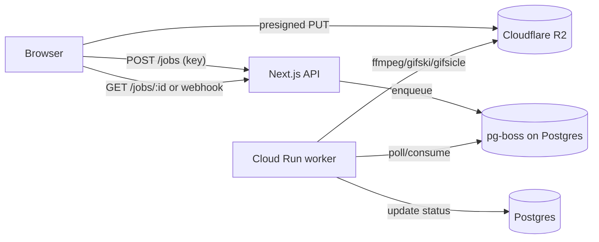

# Server-Side Media Pipeline & Infra Cost — Research Report
2026-08-04

## 1. Encoder toolchain

| Tool | Best for | Quality | Speed | Verdict |
|---|---|---|---|---|
| ffmpeg palettegen/paletteuse | video→GIF, universal glue | High (tunable) | Fast | **Core engine**, use for all format conversions |
| gifski | video/PNG-seq→GIF final polish | Highest (best gradients, temporal dithering, pngquant-based cross-frame palette) | Slower (~2-5x ffmpeg) | Use for "high-quality" PRO mode |
| gifsicle | GIF optimize/lossy compress, frame edit | N/A (post-process) | Very fast | **Best-in-class for optimize/resize/compress on existing GIFs** |
| ImageMagick | Simple resize/crop/overlay, batch glue | Medium | Slow, memory-heavy | Avoid as core encoder; fine for text overlay/simple ops only |
| libvips | Static image resize at scale | N/A (no native animated GIF encode parity) | Fastest, low memory | Use only if adding static image tools later; not a GIF engine |

Sources: [gifski repo/CRAN](https://packages.oit.ncsu.edu/cran/web/packages/gifski/index.html), [ubitux ffmpeg palette guide](https://blog.pkh.me/p/21-high-quality-gif-with-ffmpeg.html), [gifsicle man page](https://man.archlinux.org/man/gifsicle.1.en), [kornel.ski lossygif](https://kornel.ski/lossygif). Consensus across sources: gifski = best visual quality but bigger files/slower; ffmpeg+palette = best CLI control/speed; gifsicle = best for post-hoc lossy shrink.

**Recommended pipeline design: two-tier**
- Fast/free-adjacent server jobs → ffmpeg palettegen/paletteuse (1-pass quality, sub-second for short clips)
- PRO "best quality" toggle → gifski (slower, worth it for paid tier CPU budget)
- All GIF outputs pass through gifsicle `-O3` as a final optimize/lossy pass regardless of encoder used.

### Recipes (top 5 ops)

**1. Video → GIF (ffmpeg, two-pass palette, default/fast tier)**
```bash
ffmpeg -i in.mp4 -vf "fps=15,scale=480:-1:flags=lanczos,palettegen=stats_mode=diff" -y palette.png
ffmpeg -i in.mp4 -i palette.png -lavfi "fps=15,scale=480:-1:flags=lanczos[x];[x][1:v]paletteuse=dither=bayer:bayer_scale=3:diff_mode=rectangle" -y out.gif
```

**1b. Video → GIF (gifski, PRO best-quality tier)**
```bash
ffmpeg -i in.mp4 -vf "fps=20,scale=720:-1:flags=lanczos" -f image2pipe -vcodec ppm - | \
gifski -o out.gif --fps 20 --quality 90 --width 720 -
```

**2. GIF optimize/compress (gifsicle lossy)**
```bash
gifsicle -O3 --lossy=80 --colors 128 in.gif -o out.gif
# lossy range 30 (light) - 200 (heavy); 60-100 is typical "smart compress" sweet spot
```

**3. GIF resize/crop**
```bash
gifsicle --resize 480x_ --crop 0,0+480x270 -O2 in.gif -o out.gif
```

**4. GIF → MP4/WebM/WebP**
```bash
ffmpeg -i in.gif -movflags faststart -pix_fmt yuv420p -vf "scale=trunc(iw/2)*2:trunc(ih/2)*2" out.mp4
ffmpeg -i in.gif -c:v libvpx-vp9 -b:v 0 -crf 32 out.webm
ffmpeg -i in.gif -vcodec libwebp -lossless 0 -q:v 75 -loop 0 -an -vsync 0 out.webp
```

**5. Add text/overlay (ffmpeg drawtext, then re-palette)**
```bash
ffmpeg -i in.gif -vf "drawtext=text='Caption':fontfile=/fonts/Inter.ttf:fontsize=36:fontcolor=white:borderw=2:x=(w-tw)/2:y=h-th-20,split[a][b];[a]palettegen[p];[b][p]paletteuse" -y out.gif
```

**Batch**: queue N single-file jobs (see §3), don't build a bespoke batch-mode ffmpeg filtergraph — keeps worker code uniform and parallelizable.

---

## 2. Runtime/deployment options ($20-50/mo)

| Option | Scale-to-zero | ffmpeg support | Cold start | $/1000 jobs* | Notes |
|---|---|---|---|---|---|
| Hetzner CPX21/31 VPS | No (always-on) | Native, full control | None | ~$0 marginal (flat $22-37/mo) [Hetzner via Northflank/VPSBenchmarks](https://northflank.com/blog/hetzner-cloud-server-price-increases) | Cheapest at low-mid volume; you manage queue/OS/security patching |
| Fly.io Machines | Yes, per-second billing | Native (Docker) | 1-3s | ~$0.02-0.05/job (10s job @ shared-cpu-1x ~$0.0000067/s) [Fly docs](https://fly.io/docs/about/pricing/) | Good middle ground; **volumes bill even when stopped** |
| Cloudflare Containers | Yes, billed per 10ms active | Yes (GA Apr 2026, native binaries/full FS) | Sub-second (est.) | Workers Paid $5/mo base + compute; ~4GiB 24/7 example ≈ $82/mo, but idle-billed-only mode is far cheaper for bursty jobs [Cloudflare docs](https://developers.cloudflare.com/containers/pricing/) | New (GA Apr 2026), thin ops track record — adoption risk |
| AWS Lambda (container image) | Yes | Yes, up to 10GB image, 10GB /tmp | 1-5s (cold, big image) | Cheap per-invocation but 15-min hard timeout, complex packaging | Good fallback/burst; avoid as primary due to cold-start + packaging friction |
| Google Cloud Run | Yes | Yes (any container) | ~1-2s | Free tier 180k vCPU-s + 360k GiB-s/mo; beyond: $0.000024/vCPU-s, $0.0000025/GiB-s [search-derived, verify live](https://cloud.google.com/run/pricing) | 60-min timeout GA — best serverless fit for long jobs; free tier alone likely covers MVP volume |
| Railway | Per-second | Yes | Fast | $20/vCPU-mo + $10/GB-mo, usage-based | Good DX, pricier than Fly at scale |
| Render | Flat/mo | Yes | N/A (always-on plans) | Starter $7/mo (0.5 vCPU/512MB) — too small for video jobs | Not CPU/timeout-friendly for this workload |
| Modal | Per-second, GPU-first | Yes | Fast | CPU pricing not GPU-comparable; overkill (built for ML/GPU) | Skip — wrong tool shape |

*Assumes avg job = 10s video→GIF, 5-15s CPU time.

**Recommendation: Google Cloud Run (primary) + Hetzner CPX21 VPS (fallback/steady-state).**
- Cloud Run's free tier (180k vCPU-s/mo ≈ 18k jobs at 10s CPU) plus true scale-to-zero fits a bursty, unpredictable-traffic MVP inside the $20-50 budget with near-zero cost until real usage appears. 60-min timeout GA handles even large batch jobs.
- Once volume is steady/predictable (e.g., >50k jobs/mo), move steady-state processing to a flat-rate Hetzner CPX21 ($22-37/mo, always-on, no per-invocation billing) fronted by your own queue — flatter unit economics than any serverless option at volume.
- Fly.io is a reasonable single-platform alternative if you want Postgres+worker+app co-located in one ecosystem, but its stopped-volume billing gotcha and less mature autoscale-to-zero UX put it second.
- Cloudflare Containers is promising (GA April 2026, native ffmpeg support) but too new for a solo dev to bet the MVP on — revisit in 6-12 months once more production case studies exist. [InfoQ GA note](https://www.infoq.com/news/2026/04/cloudflare-sandboxes-ga/)
- Skip AWS Lambda as primary: container packaging (ffmpeg static binary + layers) and cold starts add solo-dev complexity disproportionate to benefit; fine as an overflow worker later.

---

## 3. Job architecture

**Recommend: async job queue + presigned direct-to-R2 uploads.** Sync (hold HTTP connection) only for sub-2s trivial ops (gifsicle optimize on small files); everything else async with polling/webhook.

- **Queue**: pg-boss on the same Postgres you already run for the app (no separate Redis to operate) is the simplest choice for a solo dev at this scale — ACID, SKIP LOCKED, zero extra infra. Move to BullMQ+Redis (e.g. Upstash, free tier 500k commands/mo) only if throughput/features (rate limiting, flows, priorities) become a real bottleneck. [pg-boss vs BullMQ comparison](https://hookdeck.com/webhooks/platforms/bullmq-alternatives-for-webhook-retries)
- **Uploads**: client gets a presigned R2 PUT URL, uploads directly, then enqueues a job referencing the object key. Never proxy raw file bytes through your app server.
- **Storage**: Cloudflare R2 — $0.015/GB-mo storage, **zero egress fee**, Class A (write) $4.50/M, Class B (read) $0.36/M. This beats S3 ($0.023/GB storage + $0.09/GB egress) and even B2 (cheaper storage at ~$0.006/GB but egress caps at 3x stored data, then $0.01/GB) for a public-serving GIF site where egress volume will dominate. [R2 vs S3 vs B2 comparison](https://tech-insider.org/cloudflare-r2-vs-s3-vs-backblaze-b2-2026/)
- **Lifecycle**: R2 lifecycle rules auto-delete free-tier outputs after 24-48h; PRO outputs retained per plan (e.g. 30 days) then auto-purged. This is the primary lever controlling storage cost growth.



---

## 4. Abuse & cost control

- **Rate limiting**: Cloudflare (edge, free) for IP/ASN-level; Upstash `@upstash/ratelimit` (free tier 500k commands/mo) for per-user/API-key sliding-window limits at the app layer. [Upstash pricing](https://upstash.com/docs/redis/overall/pricing)
- **Bot protection**: Cloudflare Turnstile — free, unlimited, no volume cap for standard tier; gate free-tier server endpoints (not client-side WASM tools, which need no protection since they cost you nothing). [Turnstile pricing 2026](https://blog.cloudflare.com/turnstile-ga/)
- **Hard caps**: file size cap (e.g. 50MB free-server / 500MB PRO), duration cap (e.g. 30s free-server / 5min PRO), concurrent-job-per-IP cap, worker wall-clock timeout (kill at 60-120s).
- **API tier**: API keys + prepaid credit/quota system, enforced server-side before enqueueing (not just at billing time).
- **ffmpeg on untrusted input — real risk**: ffmpeg has a large demuxer/decoder attack surface; historical CVEs include heap overflows and OOB reads in obscure demuxers, plus SSRF-style risks via network-capable input protocols (`http://`, `concat:`, `subfile:` etc. can be abused to read local files or hit internal endpoints if not restricted). [gVisor sandbox architecture](https://gvisor.dev/docs/architecture_guide/intro/), [ffmpeg sandboxing writeup](https://hoop.dev/blog/building-a-secure-ffmpeg-sandbox-environment)
- **Mitigations** (layer these, cheapest first):
  1. `-protocol_whitelist file,pipe` (disable network/demuxer protocols entirely for untrusted uploads)
  2. Run worker in a container with strict resource limits (CPU/mem/pids), read-only rootfs, no network egress from the ffmpeg process
  3. seccomp profile restricting syscalls; drop all Linux capabilities
  4. For higher assurance at low marginal cost: Cloud Run's containers already run on gVisor by default — this alone materially reduces kernel-exploit blast radius vs a bare Docker/VPS setup, which is another point in Cloud Run's favor for this specific untrusted-media workload.
  5. Always pin/update ffmpeg version; track CVEs via distro security feeds.

---

## 5. API productization

Minimal sellable surface (modeled on Cloudinary/Transloadit patterns — URL/key-based, webhook-first):

- `POST /v1/jobs` — body: `{operation, source_url|presigned_key, params}` → returns `{job_id, status}` (202 Accepted, async by default)
- `GET /v1/jobs/:id` — status + result URL when done (polling fallback)
- `POST` webhook callback on completion (preferred; [Cloudinary confirms webhooks > polling for efficiency](https://cloudinary.com/blog/webhooks_upload_notifications_and_background_image_processing))
- Auth: `Authorization: Bearer <api_key>`, metered via Postgres counter or Upstash counter, checked pre-enqueue
- Docs: OpenAPI spec + 4-5 copy-paste curl examples (video→gif, optimize, resize, convert) — this alone is what makes a dev tool "feel" payable
- Smallest surface a developer would pay for: **one endpoint** that does video→GIF and GIF→MP4/WebP well, with reliable webhooks and predictable per-job pricing — not a feature-complete platform. Cloudinary/Transloadit win on breadth; you win on being cheaper/simpler for this one job.

---

## 6. Recommended architecture (MVP → 12mo)

**MVP (month 1-3, target <$30/mo actual spend)**: Next.js app (Vercel/self-host) → Cloudflare R2 (presigned uploads) → pg-boss queue on existing Postgres → Cloud Run worker (ffmpeg+gifsicle+gifski in one container image) → Turnstile + Cloudflare rate limiting on public endpoints. This stays inside free tiers almost entirely at low volume.

**Scaling path**: once server-tier jobs exceed ~15-20k/mo consistently, add a flat-rate Hetzner CPX21/31 VPS as a second worker pool (cron/queue-consumer) to cut per-job cost below Cloud Run's marginal rate; keep Cloud Run as burst/overflow. At API-product scale (>200k jobs/mo), consider dedicated bare-metal or multiple Hetzner boxes behind the same queue — the queue abstraction means the switch is transparent.

### Monthly cost table (illustrative, 2% of free jobs hit server tier, 10s CPU/job avg)

| Free jobs/mo | Server jobs (2%) | Cloud Run compute* | R2 storage+ops (rough) | Base infra (DB/app hosting) | **Total/mo** |
|---|---|---|---|---|---|
| 10,000 | 200 | $0 (within free tier) | ~$1-2 | $10-15 | **~$15-20** |
| 100,000 | 2,000 | ~$1-3 (mostly still free-tier) | ~$5-10 | $15-20 | **~$25-35** |
| 1,000,000 | 20,000 | ~$15-30 (exceeds free tier meaningfully) | ~$30-50 | $20-30 (likely need bigger DB) | **~$70-110** — at this point move server jobs to Hetzner VPS ($22-37/mo flat) to bring this back under $50-60 |

*Cloud Run compute estimated from $0.000024/vCPU-s + $0.0000025/GiB-s beyond 180k vCPU-s / 360k GiB-s free tier; verify live at [cloud.google.com/run/pricing](https://cloud.google.com/run/pricing) before committing budget.

---

## Unresolved questions
- Exact current Cloud Run Tier 1 pricing figures were search-derived, not fetched from the live pricing page (fetch was truncated) — verify `$0.000024/vCPU-s` and `$0.0000025/GiB-s` figures directly before finalizing budget.
- No hard ffmpeg CVE list/count was found in this pass — a dedicated CVE database check (NVD) is recommended before finalizing the sandboxing threat model.
- Cloudflare Containers real-world cost at bursty (not 24/7) workloads wasn't benchmarked — only the 24/7 example was available; worth a small pilot before considering it as primary.
- Gifski CLI throughput (jobs/sec on typical worker vCPU) wasn't benchmarked numerically — recommend a quick local benchmark against sample video assets before committing PRO-tier CPU budget assumptions.
